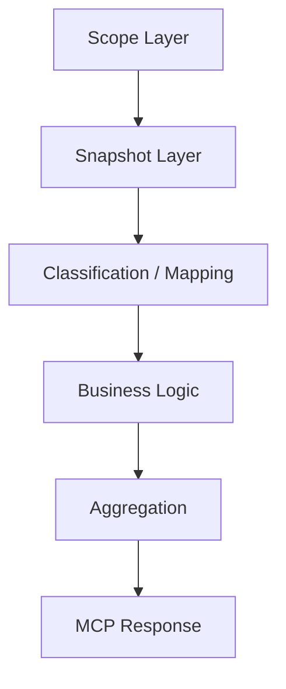
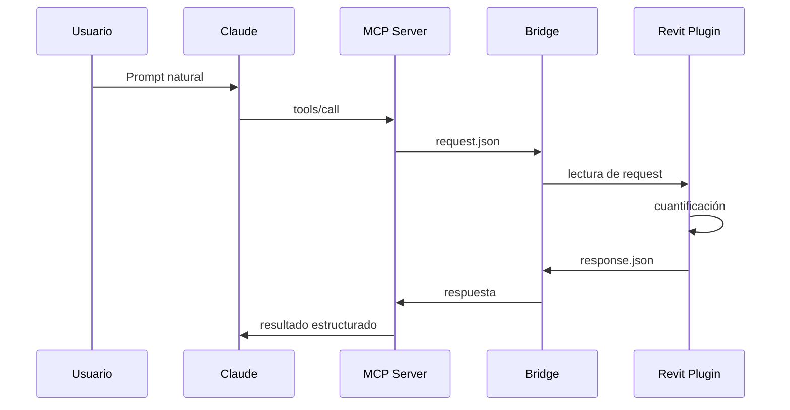

# RevitMCPBOQ

Motor de cuantificación BIM asistido por IA para **Revit + MCP**, orientado a preconstrucción, BOQ/BOM y extracción estructurada de cantidades por disciplina.

> Proyecto hermano Navisworks: [MCP-navis-boq](https://github.com/JefaturaBIM94/MCP-navis-boq)

---

## 1. Qué es este proyecto

**RevitMCPBOQ** conecta un modelo abierto en **Autodesk Revit** con un **MCP Server** para que Claude pueda ejecutar corridas de cuantificación y devolver resultados estructurados por:

- nivel
- sistema
- categoría
- familia
- tipo
- instancia

La solución está pensada para evolucionar por corridas disciplinares y mantener una arquitectura desacoplada entre:

- **Core** → reglas de negocio y modelos
- **Plugin Revit** → lectura del modelo y bridge con Revit
- **MCP Server** → exposición de tools a Claude

---

## 2. Objetivo del producto

Reducir la fricción entre el modelo BIM y la cuantificación técnica/constructiva, habilitando consultas y corridas automáticas desde lenguaje natural, sin depender de exportaciones manuales repetitivas.

Casos de uso principales:

- cuantificación por selección actual
- cuantificación por nivel
- cuantificación por sistema MEP
- resúmenes BOQ por disciplina
- detalle expandible por tipo e instancia
- estimaciones constructivas, no solo conteo geométrico

---

## 3. Arquitectura general


### Capas



### Proyectos

- `NavisBOQ.Core`
- `NavisBOQ.Revit.Plugin`
- `NavisBOQ.Revit.McpServer`

---

## 4. Estado funcional actual

### Corrida 4 — Eléctrica
**Estado:** operativa / base productiva

Cuantifica y agrupa elementos eléctricos en Revit con soporte para:
- clasificación por sistema
- agrupación por nivel
- piezas
- longitudes
- detalle expandible

Incluye tool:
- `run_preconstruccion_4`
- `expand_electrical_detail`

### Corrida 5 — HVAC
**Estado:** operativa v1 / en validación fina

Soporta:
- **Ducts**
- **Duct Fittings**
- **Pipes**
- **Pipe Fittings**
- **Duct Accessories**
- **Pipe Accessories**
- **Mechanical Equipment**
- **Air Terminals**
- **Generic Models HVAC**

Enfoque actual:
- agrupación por **Nivel → Clasificación de sistema → Nombre de sistema**
- **conductos**: longitud, área, calibre y kilos
- **uniones de conducto**: kilos por área directa o estimación geométrica/fallback
- **tuberías**: longitud, tamaño y material
- categorías restantes: conteo de piezas

Incluye tool:
- `run_preconstruccion_5`

---

## 5. Corridas del sistema

### Corrida 1 — Arquitectura
**Estado:** WIP / legado estabilizado en línea de producto  
**Objetivo:** muros, losas, cubiertas, plafones, puertas, ventanas y categorías generales.

Métricas típicas:
- área
- volumen
- longitud
- piezas

### Corrida 2 — Estructura / concreto
**Estado:** WIP / legado estabilizado en línea de producto  
**Objetivo:** columnas, vigas, cimentaciones, muros y losas estructurales.

Métricas típicas:
- volumen
- longitud
- área

### Corrida 3 — Estructura metálica
**Estado:** WIP / legado estabilizado en línea de producto  
**Objetivo:** cuantificación de acero estructural.

Métrica principal:
- **kg**

Lógica base:
- `peso = peso lineal x longitud`
- fallback por volumen y densidad cuando aplica

### Corrida 4 — Eléctrica
**Estado:** operativa  
**Objetivo:** cuantificación eléctrica por selección, nivel y detalle lazy.

### Corrida 5 — HVAC
**Estado:** operativa v1  
**Objetivo:** cuantificación HVAC / MEP con enfoque constructivo para ductería y piping.

---

## 6. Tools MCP disponibles

### Infraestructura
- `ping`
- `list_available_tools`
- `active_document_info`
- `diagnose_selection`

### Corridas
- `run_preconstruccion_4`
- `expand_electrical_detail`
- `run_preconstruccion_5`

---

## 7. Qué cuantifica hoy Corrida 5 HVAC

### Ducts
- nivel
- clasificación de sistema
- nombre de sistema
- tipo
- tamaño
- longitud
- área
- calibre
- kilos de lámina

### Duct Fittings
- sistema
- tipo
- tamaño
- dimensiones de fitting
- área directa o estimada
- calibre
- kilos
- método de cálculo

### Pipes
- nivel
- sistema
- tipo
- tamaño
- longitud
- material
- segmento de tubería

### Pipe Fittings
- sistema
- familia / tipo
- cantidad de piezas

### Otros HVAC
- accesorios de ducto
- accesorios de tubería
- equipos mecánicos
- terminales de aire
- modelos genéricos HVAC

---

## 8. Lógica HVAC actual

### Agrupación
- Nivel
- Clasificación de sistema
- Nombre de sistema
- Categoría BOQ
- Familia
- Tipo

### Reglas de conductos
- uso de `Area` como fuente principal cuando existe
- fallback por geometría si hace falta
- asignación de calibre por dimensión mayor
- cálculo de kilos:
  - `kg = area_m2 x espesor_m x densidad`

### Reglas de fittings
- si hay área directa: usarla
- si no: estimación geométrica
- si no: fallback factor
- método devuelto:
  - `DirectArea`
  - `GeometricEstimate`
  - `FallbackFactor`

---

## 9. Estructura sugerida del repositorio

```text
RevitMCPBOQ/
│
├── NavisBOQ.Core/
│   ├── Models/
│   ├── Constants/
│   ├── Policies/
│   ├── HVAC/
│   └── Electrical/
│
├── NavisBOQ.Revit.Plugin/
│   ├── Infrastructure/
│   ├── RevitServices/
│   ├── ToolHandlers/
│   └── ...
│
├── NavisBOQ.Revit.McpServer/
│   ├── Mcp/
│   ├── Transport/
│   └── ...
│
├── README.md
├── .gitignore
└── RevitMCPBOQ.sln
```

---

## 10. Instalación y preparación

### Requisitos
- Windows
- Autodesk Revit
- Visual Studio
- .NET compatible con la solución
- Claude Desktop con soporte MCP
- Git

### Preparación general
1. Clona o descarga el proyecto.
2. Abre la solución en Visual Studio.
3. Compila la solución completa.
4. Abre Revit con un modelo válido.
5. Carga o ejecuta el plugin de Revit.
6. Inicia el MCP Server.
7. Conecta Claude Desktop al server MCP.
8. Lanza corridas en lenguaje natural.

---

## 11. Cómo probarlo

### Flujo de prueba



### Prompts naturales de prueba

#### Sanity check
- `Valida que el proyecto esté conectado y dime qué documento de Revit está activo.`

#### Corrida 4
- `Ejecuta la corrida 4 eléctrica sobre mi selección actual en modo detalle.`
- `Expande el detalle eléctrico de mi selección actual.`

#### Corrida 5
- `Ejecuta la corrida 5 HVAC sobre mi selección actual en modo detalle.`
- `Muéstrame solo conductos y uniones de conducto con tamaño, longitud, área, calibre y kilos.`
- `Muéstrame solo tuberías y uniones de tubería agrupadas por nivel, clasificación de sistema y nombre de sistema.`

---

## 12. Publicación a GitHub

> Nota: este proyecto todavía no tiene repositorio propio en GitHub al momento de esta documentación.

### Nombre sugerido del nuevo repo
- `RevitMCPBOQ`
- `revit-mcp-boq`
- `revit-boq-mcp`

### Descripción sugerida
`Motor de cuantificación BIM para Revit + MCP, con corridas de preconstrucción eléctrica y HVAC.`

### Visibilidad recomendada
- **Private** al inicio, mientras se afinan corridas y documentación.
- Después puedes pasarlo a público si quieres abrirlo como showcase técnico.

---

## 13. Paso a paso para subirlo a GitHub

### A. Crear el repositorio en GitHub
1. En GitHub, en la esquina superior derecha, haz clic en **+** y luego en **New repository**.
2. Elige como owner tu cuenta **JefaturaBIM94**.
3. Nombre sugerido: `RevitMCPBOQ`.
4. Agrega descripción.
5. Elige **Private** o **Public**.
6. Si ya tienes el proyecto local listo, **no inicialices** con README adicional para evitar conflictos.
7. Haz clic en **Create repository**. GitHub documenta ese flujo desde la UI web y también indica que puedes crear el repo desde CLI si prefieres. citeturn710702view0

### B. Inicializar Git localmente
Desde la raíz del proyecto:

```bash
git init
git branch -M main
```

### C. Agregar archivos
```bash
git add .
git commit -m "feat: initial RevitMCPBOQ project structure"
```

### D. Conectar el remoto
GitHub recomienda agregar el remoto con `git remote add origin <URL>` y verificarlo con `git remote -v`. citeturn540281search4turn540281search6

Ejemplo:

```bash
git remote add origin https://github.com/JefaturaBIM94/RevitMCPBOQ.git
git remote -v
```

### E. Primer push
GitHub documenta que el patrón estándar es `git push origin main`. citeturn540281search0turn540281search4

```bash
git push -u origin main
```

---

## 14. .gitignore sugerido

```gitignore
# Visual Studio
.vs/
bin/
obj/
*.user
*.suo

# Rider / JetBrains
.idea/

# Revit / local artifacts
.bridge/
*.log
*.tmp

# Packages
packages/
TestResults/

# OS
.DS_Store
Thumbs.db
```

---

## 15. Roadmap / WIP

### Corto plazo
- cerrar refinamiento de Corrida 5 HVAC
- expand detail HVAC
- validación por familias reales
- endurecimiento de parámetros raros

### Mediano plazo
- madurar Corridas 1, 2 y 3 en esta línea Revit
- homologación BOQ ↔ BIM
- exportes más ricos
- mayor robustez de filtros por sistema y nivel

### Largo plazo
- dashboards
- reporting ejecutivo
- plantillas por disciplina
- integración más fuerte entre repos hermano Revit/Navis

---

## 16. Relación con el repo hermano Navisworks

Este proyecto convive con:

- **Navisworks / federado:** [MCP-navis-boq](https://github.com/JefaturaBIM94/MCP-navis-boq)

Propuesta de posicionamiento:

- **Navisworks repo** = línea legacy / federada / coordinación
- **Revit repo** = línea operativa principal / authoring model / crecimiento futuro

---

## 17. Recomendaciones antes de publicar

Antes de subir el repo:
- confirmar que no subas rutas locales sensibles
- revisar `.bridge/`
- revisar secretos / tokens / credenciales
- validar `.gitignore`
- confirmar que el README refleje estado real
- dejar claro qué está **operativo** y qué está **WIP**

---

## 18. Licencia y colaboración

Si el repo será privado interno, puedes dejar licencia pendiente por ahora.  
Si lo quieres público después, define:
- MIT
- Apache-2.0
- o licencia propietaria interna

---

## 19. Estado recomendado para el primer release de repo

### Debe incluir
- solución compilable
- README base
- `.gitignore`
- descripción de corridas
- instrucciones mínimas de prueba

### Puede quedar para segundo commit
- screenshots
- gifs
- diagramas más refinados
- wiki
- changelog

---

## 20. Próximo paso después de publicar

1. crear el repo
2. subir código base
3. validar primer push
4. ajustar README si hace falta
5. seguir con afinación final de corridas

---

## 21. Contacto / ownership

**Owner sugerido:** `JefaturaBIM94`  
**Línea de producto:** BOQ BIM / MCP / Revit / Preconstrucción
